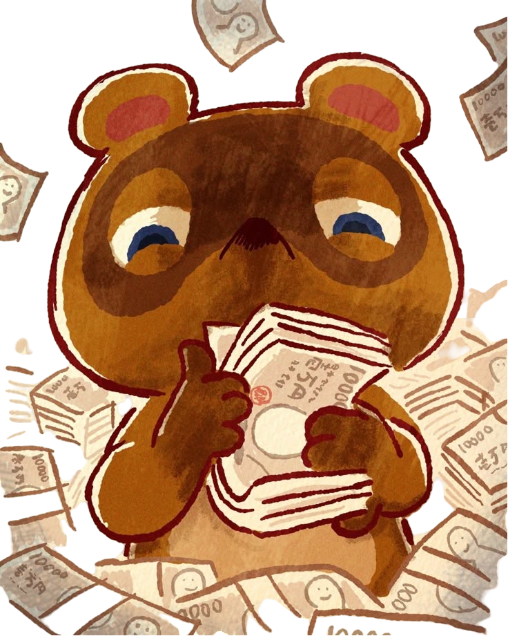

# Don`t take my bells!



[🎮 **Play the Game!**](https://albaperez26.github.io/Game-proyect/s)

---

## 📝 Description

**Don't take my bells!** It’s a game where the character must collect as many bells as possible while jumping across branches, avoiding the enemy.
The game ends when the character collides with the enemy or falls to the ground.
When the game ends, a screen appears with a restart button.

---

## ⚙️ Main Functionalities

- Branches move automatically; player change direction using **Left** and **Right**.
- **Enemy** appear at random positions and intervals from the top.
- **Bells** appear at random positions and intervals from the top.
- Game ends when **player** collides with the enemy.
- Game ends when **player** collides with the floor.

---

## 📌 Backlog Functionalities

- Change the background and difficulty, adding 2 more levels in total.
- Allow the character to shoot fossils at the enemy.
- Add a victory screen when the player wins.

---

## 💻 Technologies Used

- HTML
- CSS
- JavaScript
- DOM Manipulation
- JS Canvas
- JS Classes
- Local Storage
- `Audio()` and `Image()` objects

---

## 🧭 Game States

- Start Screen
- Game Screen
- Game Over Screen

---

## 📁 Project Structure

- `buildDom()`
- `main()`
- `createSplashScreen()`
- `removeSplashScreen()`
- `createGameScreen()`
- `removeGameScreen()`
- `createGameOverScreen()`
- `removeGameOverScreen()`
- `startGame()`
- `gameOver()`

### `main.js`

```js
startGame();

// Functions:
gameLoop();
caerRamitas();
caerToms();
caerBayas();
comprobarSiCanelaMuere();
actualizarPuntuacion();
generarRamitas();
comprobarSiExisteRamita(x, y, margen);
comprobarSiExisteTom(x, y, margen);
CheckCollisionCanelaRamita();
CheckCollisionCanelaTom();
CheckCollisionCanelaBaya();
restartGame();
```

### `canela.js`

```js
gravityEffect();
jump();
moverseDerecha();
moverseIzquierda();
```

### `bayas.js`

```js
caerBaya();
eliminarBaya();
```
